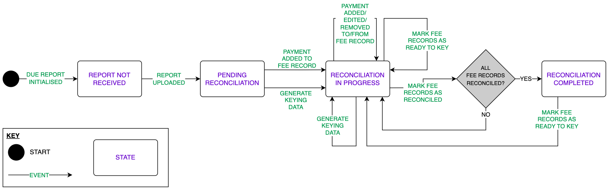

# State Machines

[State machines](https://en.wikipedia.org/wiki/Finite-state_machine) are a visual and mathematical way of modeling stateful logic using three main building blocks:

- **STATES**, which represent different behaviors
- **EVENTS**, which represent something that happened that can change state
- **TRANSITIONS**, which represent how the state can change and what actions are executed when an event is received

By modeling our logic as a state machine we

- ensure that all valid and invalid transitions are thought about and handled appropriately
- can easily follow the intended lifecycle of an entity

## Code example

The following example shows how we translate the three state machine building blocks (states, events, and transitions) to code:

### STATE

A `UtilisationReportEntity` represents a utilisation report in the SQL database. This entity contains a `status` property that we will use as the state.

### EVENT

An event is triggered from a controller in response to an API call, or maybe from another state machine:

```typescript
const existingReport = await UtilisationReportRepo.getOneById(reportId);

const stateMachine = UtilisationReportStateMachine.forReport(existingReport);

const updatedReport = await stateMachine.handleEvent({
  type: 'FEE_RECORD_KEYED',
  payload: { feeRecordId: 123 },
});

return res.status(200).send(updatedReport);
```

The logic of how the event is handled is abstracted away from the calling function to the state machine.

With the help of TypeScript, the event `type` property is limited to those defined by the state machine, with the type of `payload` dynamically updating to tell you what needs to be provided to process the event.

### TRANSITIONS

The state machine determines whether the event type is valid for the current state of the report then calls the relevant handler to process the transition:

```typescript
public async handleEvent(event: UtilisationReportEvent): Promise<UtilisationReportEntity> {
  switch (this.report?.status) {
    ...
    case UTILISATION_REPORT_RECONCILIATION_STATUS.RECONCILIATION_IN_PROGRESS:
      switch (event.type) {
        case 'PAYMENT_REMOVED_FROM_FEE_RECORD':
          return handleUtilisationReportPaymentRemovedFromFeeRecordEvent(this.report, event.payload);
        case 'FEE_RECORD_KEYED':
          return handleUtilisationReportFeeRecordKeyedEvent(this.report, event.payload);
        default:
          return this.handleInvalidTransition(event);
      }
    case UTILISATION_REPORT_RECONCILIATION_STATUS.RECONCILIATION_COMPLETED:
      switch (event.type) {
        case 'MANUALLY_SET_INCOMPLETE':
          return handleUtilisationReportManuallySetIncompleteEvent(this.report);
        default:
          return this.handleInvalidTransition(event);
      }
    ...
  }
}
```

In this simplified example note how we take a "state-first" approach, as opposed to an "event-first" approach, first switching on `this.report?.status` then `event.type`. This method matches how we would read the visual state machine (see [Utilisation Reports](#utilisation-reports) below), so makes it easier to reason about, and ensure that all scenarios have been accounted for.

In the example above you can see that if the report is in `'RECONCILIATION_IN_PROGRESS'` status there are only two valid events that can occur, and this matches the two outward arrows in the diagram below. For each of these two valid event types the relevant handler is called to handle the transition. For any other event type the `this.handleInvalidTransition` will be called, resulting in an error.

## Diagrams

Note: all source `.drawio` files for the following state machine diagrams are contained with the [assets](./assets) directory, so they can easily be updated if required.

### Utilisation Reports


