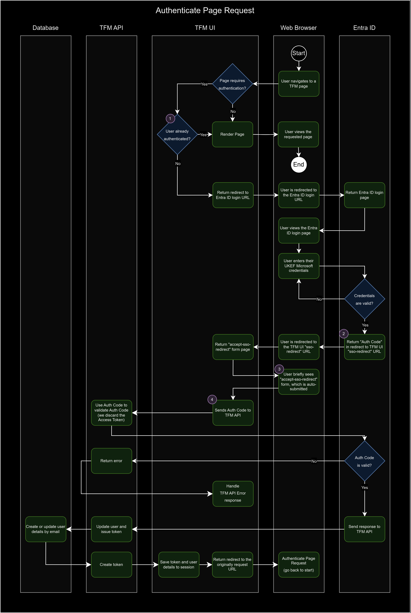

# Trade Finance Manager Single Sign-On (TFM SSO)

## Overview

TFM uses
[Entra ID](https://www.microsoft.com/en-gb/security/business/identity-access/microsoft-entra-id)
(formerly Azure Active Directory) for Single Sign-On (SSO) authentication.

This means that instead of handling our own authentication, the user is
redirected to a Microsoft login page. They do not require a separate set of TFM
login credentials, instead using their UKEF Microsoft credentials. Microsoft
will handle both login failures and successes, and then on success redirect the
user back to the TFM application.

## Process flow diagrams

Note: all source `.drawio` files for the following diagrams are contained within
the [assets](./assets) directory, so they can be updated if required.

### Key

### Authenticate Page Request

Notes:

1. We verify if the user is already authenticated by checking for an existing
   `userToken` value in the UI server session.

2. You'll notice that Entra ID initially returns an "Auth Code", which we then
   need to check the validity of in TFM API. Usually, this check is used to gain an Access Token from Entra, however in our case, we are using our own local token issuing policy. As a result, we perform this check but immediately discard the Access Token and issue our own local token.

   Note: As the request for the Auth Code involves the browser, it is less secure as browsers are more susceptible to malicious attacks. The Auth Code is therefore a short-lived, one-time-use code. The Access Token (which we discard) in contrast is long-lived and can be used multiple times. As a result, we should only get an Access Token via a secure server-to-server request (TFM API to Entra ID).

   If we need to communicate with Entra multiple times, we should look to use the Access Token issued by Entra and not the auth code. This is as per the [OAuth 2.0 spec](https://oauth.net/2/).

3. Why do we briefly see an "accept-sso-redirect" form before submitting another
   duplicate request to the TFM UI? This is because we need to be able to
   access the user's session when making the request to fetch the Access Token
   from Entra ID. The session cookie has a
   [SameSite](https://developer.mozilla.org/en-US/docs/Web/HTTP/Headers/Set-Cookie#samesitesamesite-value)
   value of `Strict` (see configuration in
   [createSessionStore](../../../packages/gift-ui/src/server-setup/setup-session.ts)),
   which means that the cookie will only be made available in requests that
   originate from the same site that created the cookie. Because the original
   response with the Auth Code comes from the Entra ID login page, the cookie
   will not be available. We get around this by auto-submitting a hidden form
   from our own site, which includes the values provided in the Entra ID
   response, therefore allowing us to now access the user's session cookie. Why
   we need access to the user's session is discussed in point 4 below.

4. When we validate the Auth Code in TFM API, we need to ensure that the Auth
   Code response we received from Entra ID is from the actual request that the
   user made to log in. Without checking this we leave ourselves open to
   [CSRF](https://developer.mozilla.org/en-US/docs/Glossary/CSRF) attacks. When
   making the original request for the Auth Code, we include a
   [state](https://datatracker.ietf.org/doc/html/rfc6819#section-3.6) parameter
   in the request, which includes a randomly generated `csrfToken` (see
   [getAuthCodeUrl](../../../packages/gift-ui/src/modules/auth/entra-id/entra-id.service.ts)).
   The full request is then stored in the session (see the use of
   `session.authCodeUrlRequest` in the
   [EntraIdStrategy](../../../packages/gift-ui/src/modules/auth/entra-id/entra-id.strategy.ts)).
   When making the follow-up request to validate the Auth Code, we obtain the
   original Auth Code request details from the session and include them in the
   request.
   This allows us to validate that the state in our original request matches the
   state in the Auth Code response received back from Entra ID via the redirect.
